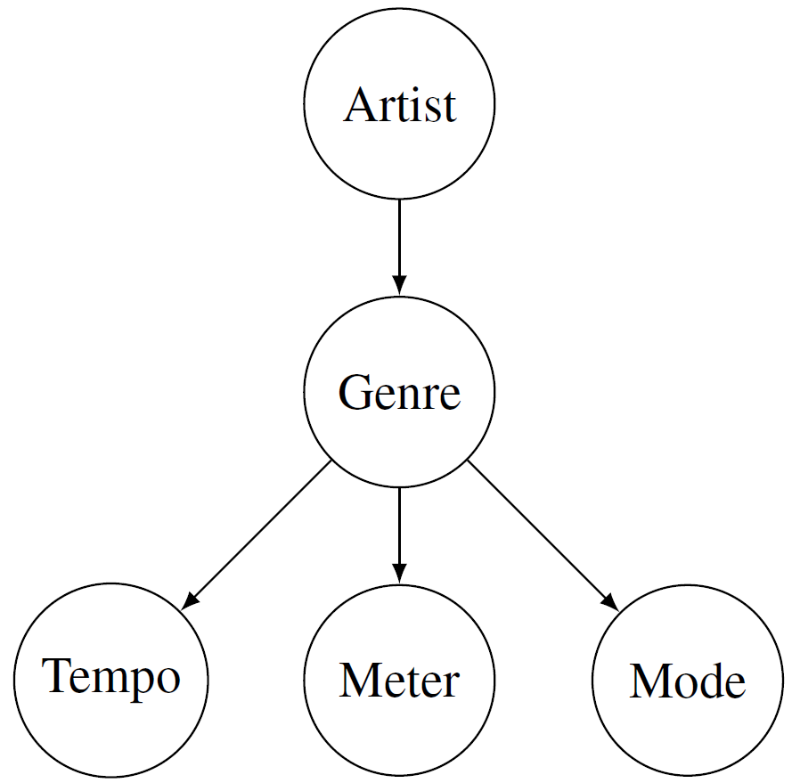
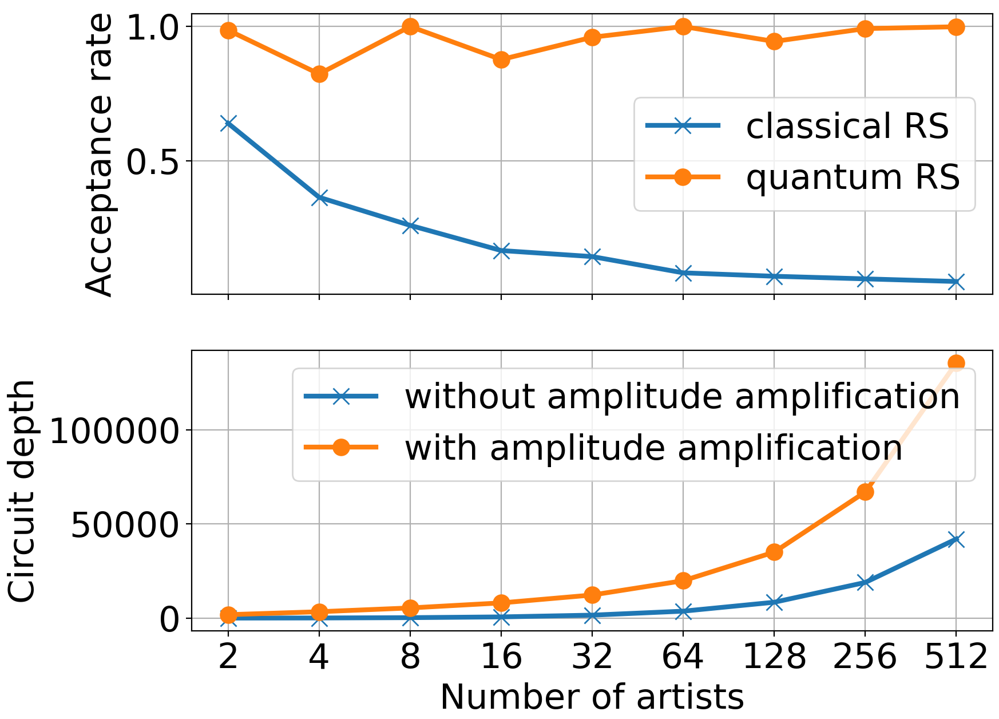
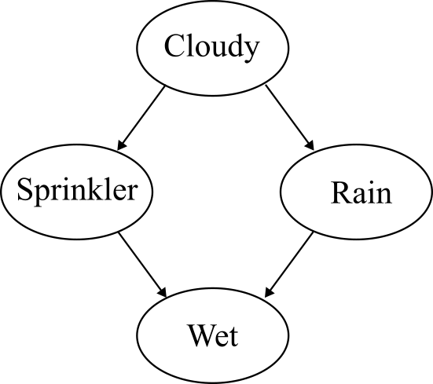

# Modeling Musical Knowledge with Quantum Bayesian Networks

This is the official implementation of the paper **Modeling Musical Knowledge with Quantum Bayesian Networks**, presented at the *International Conference on Content-based Multimedia Indexing* in Reykjavik in September 2024 [Krebs2024]. Although, the paper presents a music use case, the package can be used for other discrete Bayesian networks as well.

The code provides the following functionality:

* Translate a discrete Bayesian network to a Quantum circuit, such that measuring the quantum circuit produces samples from the joint distribution.
* Perform amplitude amplification to sample from a posterior distribution $P(X|Y)$ as described by [Low2014]. This way, inference can be performed using Quantum rejection sampling.

## Setup

To install the requirements using Conda, run
```
# Create conda environment
conda create -n qubayes python=3.12
conda activate qubayes
git clone https://github.com/JR-DIGITAL/qubayes.git
cd qubayes
pip install -r requirements.txt
pip install -e .
```

## Reproduce paper results

#### Data preparation

* Download the [spotify-tracks-dataset](https://huggingface.co/datasets/maharshipandya/spotify-tracks-dataset) and save the `dataset.csv` file to the `qubayes/data` folder.
* Adjust the paths in the file to match your local environment `qubayes/qubayes/config.py`

#### Experiment 1: Comparison of sampling methods

Execute

```
python perform_experiment1.py
```
to compute the posterior probabilities mentioned in the paper using classical rejection sampling, quantum rejection sampling, and exact inference.

#### Experiment 2: Quantum circuit depth

Execute

```
python perform_experiment2.py
```
to create Figure 4 in the paper, comparing circuit depth and acceptance ratio of a circuit with and without amplitude amplification. The results should look like this:



## Apply the toolbox to custom Bayesian networks

The toolbox can be used with any discrete Bayesian network. In this example, we implement the famous sprinkler Bayesian network from [Kevin Murphys lecture notes](https://www.cs.ubc.ca/~murphyk/Bayes/bnintro.html). To implement the Bayesian network using the QuBayes toolbox, you first have to specify the random variables as nodes and specify the corresponding prior and conditional probability tables. 


The example in the lecture notes translates to:

```
from qubayes.qubayes_tools import Node, Graph, QBN
cloudy = Node('cloudy', data=np.array([0.5, 0.5]))
sprinkler = Node('sprinkler', data=np.array([[0.5, 0.5],    # C=0
                                             [0.9, 0.1]]),  # C=1
                 parents=['cloudy'])
rain = Node('rain', data=np.array([[0.8, 0.2],    # C=0
                                   [0.2, 0.8]]),  # C=1
            parents=['cloudy'])
probs_wet = np.array([[[1.0, 0.0],      # S=0, R=0
                       [0.1, 0.9]],     # S=0, R=1
                      [[0.1, 0.9],      # S=1, R=0
                       [0.01, 0.99]]])  # S=1, R=1
wet = Node('wet', data=probs_wet, parents=['sprinkler', 'rain'])
```

Then, a graph can be created, and we can generate samples from the Bayesian network to check its sanity.

```
bn = Graph({'cloudy': cloudy, 'sprinkler': sprinkler, 'rain': rain, 'wet': wet})
samples, node_names = bn.sample_from_graph(10)
```

In the next step we translate the graph into a Quantum circuit and measure it several times:

```
qbn = QBN(bn)
result = qbn.perform_sampling(shots=n_shots)
```

Alternatively, you can specify a query and perform Quantum rejection sampling. In the following example, you set up a query for $P(S=1|W=1)$ by specifying the target (left side of the conditioning operator $S=1$) and the evidence (right side of the conditioning operator $W=1$):

```
class QuerySprinkler(Query):

    def __init__(self, graph):
        super(QuerySprinkler, self).__init__()
        self.target = {'sprinkler': 'sprinkler1'}
        self.evidence = {'wet': 'wet1'}
        self.graph_orig = graph
        self.qbn = QBN(graph)
```

Now, you can perform Quantum rejection sampling using two Grover iterations by

```
QS = QuerySprinkler(bn)
prob, acc_rate_i = QS.perform_rejection_sampling(iterations=2)
print(f'P(S=1|W=1)={prob:.3f}, acceptance ratio={acc_rate_i:.3f}')
```

and you get a result similar to:

```
>> P(S=1|W=1)=0.431, acceptance ratio=1.000
```

which is valid, as the exact solution for $P(S=1|W=1) = 0.430$.

## Errata

Unfortunately, in the paper, Query3 in Table 3 is wrong. The correct query should be:

$P(Artist=Ella Fitzgerald | Genre=Jazz, Mode=major)$, and its exact probability is 0.49.

## References
[Krebs2024]  Krebs, Florian, Hermann Fuerntratt, Roland Unterberger, and Franz Graf. "Modeling Musical Knowledge with Quantum Bayesian Networks." Proceedings of the International Conference on Content-based Multimedia Indexing (2024)

[Low2014]	 Low, Guang Hao, Theodore J. Yoder, and Isaac L. Chuang. "Quantum inference on Bayesian networks." Physical Review A 89.6 (2014): 062315.

## Contact

For questions and comment, please contact [Florian Krebs](mailto:florian.krebs@joanneum.at).

## Citation

If you use this code in your scientific work, we are happy if you cite the following work:

```shell
@InProceedings{krebs2024qbn,
      title={Modeling Musical Knowledge with Quantum Bayesian Networks}, 
      author={Florian Krebs and Hermann Fuerntratt and Roland Unterberger and Franz Graf},
      booktitle={Proceedings of the International Conference on Content-based Multimedia Indexing},
      year={2024}
}
```

